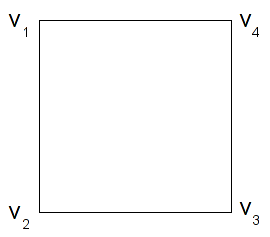
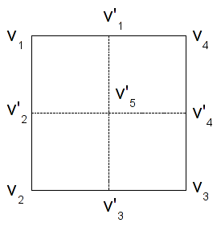
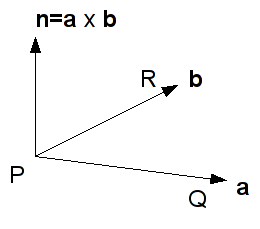
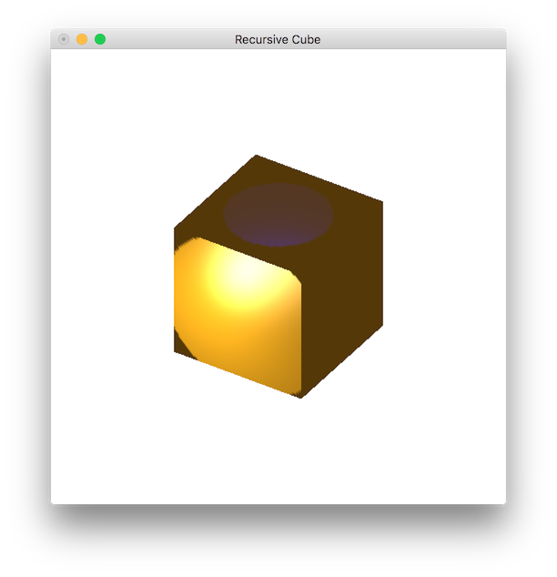

While we are now able to add numerous lighting effects into our scene, the final rendering can appear rather poor. This is due to the coarse tessalation done by the pipeline particularly for large flat surfaces. Hence if we wish to improve the lighting effect, especially for spotlights, we need to add additional geometry (along with corresponding vertex normals) in the application. Doing this by hand is quite tedious, but for regular surfaces we can use the procedure of *recursive subdivision* to repeatedly subdivide our polygon into smaller ones using a recursive function. The net result is an outwardly identical surface that is defined using a greatly increased number of vertices. While this will drastically improve our lighting effects, it comes at a significant performance penalty so it should be used with caution (or possibly in a display list). I have also included code that demonstrates the creation of a simple menu to select between the two materials.

0\. Getting Started
===================

Download [CS370\_Lab14.zip](src/CS370_Lab14.zip), saving it into the **labs** directory.

Double-click on **CS370\_Lab14.zip** and extract the contents of the archive into a subdirectory called **CS370\_Lab14**

Navigate into the **CS370\_Lab14** directory and double-click on **CS370\_Lab14.sln** (the file with the little Visual Studio icon with the 12 on it).

If the source file is not already open in the main window, open the source file by expanding the *Source Files* item in the *Solution Explorer* window and double-clicking **recursiveCube.cpp**.

If the header file is not already open in the main window, open the header file by expanding the *Header Files* item in the *Solution Explorer* window and double-clicking **lighting.h**.

If the shader files are not already open in the main window, open the shader files by expanding the *Resource Files* item in the *Solution Explorer* window and double-click **lightvert.vs** and **lightfrag.fs**.

1\. Recursive Subdivision
=========================

One simple way to add internal vertices without changing the geometry is to divide each edge of our polygon in half and connect these midpoints. Then we recurse into each newly created region and perform the same subdividing computation. We can continue this process as many times as possible, however since the process creates an exponentially growing number of vertices usually only a few levels are needed. For example, consider the following square

> 

One possible subdivision is shown below

> 

where the new vertices can be found (per component) using the formulas

> 

The new polygons are then given by (v1,v2',v5',v1'), (v2',v2,v3',v5'), (v1',v5',v4',v4), (v5',v3',v3,v4'). NOTE: Remember that the subdivided parts should maintain an *identical* orientation as the original polygon (beginning at the upper left corner in this case) for successful recursion. Each of these four squares can then be subdivided using an identical procedure into 4 subdivisions (for a total of 16) and so on.

One very nice way to accomplish the subdivision is to use a recursive function that continues to divide each square until a stopping criteria is met such as an edge length or maximum number of recursions. At this point, the routine renders the final polygon and returns to the previous level of recursion.

**Tasks**

-   Add code to **render\_Scene( )** to set **GL\_LIGHT0** as a (broad) spotlight, make it a **white\_light**, set its position and direction to **light0\_pos[ ]** and **light0\_dir[ ]**, and its cutoff angle and exponent to **light0\_cutoff** and **light0\_exp**.
-   Add code to **render\_Scene()** to set **GL\_LIGHT1** as a (narrow) spotlight, make it a **blue\_light**, set its position and direction to **light1\_pos[ ]** and **light1\_dir[ ]**, and its cutoff angle and exponential decay to **light1\_cutoff** and **light1\_exp**.
-   Change the function calls in **colorcube( )** from **rquad( )** to **div\_quad( )** and add the **div\_level** argument to each function call.
-   Add code to **div\_quad( )** when the recursion level **n** is greater than 0 to compute the midpoints (given by the local variables at the beginning of the function) and recursively call **divide\_quad( )** four times with the new vertices. NOTE: You will need to compute the midpoints on a *per component* basis. Also make sure you keep the ordering of the vertices consistent, i.e. start with the upper left-hand corner and go counterclockwise. Finally *DO NOT FORGET* to reduce the recursion level so that the recursion will eventually terminate.
-   Add code to **div\_quad( )** to call **rquad( )** (draw the surface) when the recursion level **n** is 0.

2\. Computing Normals via Cross Product
=======================================

Any three non-colinear points define a triangle which will be a *flat* polygon (which is why the pipeline uses triangles for tesselation), and thus all three vertices lie in a single *plane*. The normal to this plane can be computed by taking one of the vertices (**P**) as the common endpoint of two vectors extending through the other two points (**Q**, **R**). Using a vector operation known as the *cross product*, a third vector can be found which is *perpendicular* to these two vectors - thus will be *normal* to the plane containing the points.

> 

The vectors are computed, observing the *right-hand rule*, as follows

> 

Hence a true normal **n** is computed for the above two vectors **a** and **b** as

> 

Since this computation does not necessarily result in a *unit* normal, i.e. one with length 1, we must normalize the vector within our application (or make sure to normalize all normals in the shader). In order to perform normalization, we first compute the *norm* (or magnitude/length) of the vector as

> 

Then divide each component of the original vector by this norm to produce a *unit vector* in the same direction as

> 

**Tasks**

-   Add code to **rquad( )** to compute the normal **normal** using the *cross product* function **cross\_product()** provided in **vectorops.h**. Use the first, second, and fourth vertices as the three points.
-   Add code to **rquad( )** following the cross product computation to *normalize* the **normal** using the **normalize()** function also provided in **vectorops.h**.
-   Add code to **rquad( )** following the normalization to set the normal for the surface to **normal**.

3\. Ambient (Background) Lighting
=================================

So far we have added light sources into the scene to illuminate our objects, but if no light sources are in the direction of an object (e.g. a back face) they will appear black. While this may be realistic, it does not usually produce a visually appealing scene. Hence we can add an overall ambient background light into the scene so *all* objects have some illumination (thus allowing their ambient color to be seen regardless of light sources). This is done using the command

```cpp
glLightModelfv(GL_LIGHT_MODEL_AMBIENT, *values);
```

where *values* is an RGBA vector containing the ambient light color components. We then simply use this color vector to initialize the ambient vector in the shader prior to accumulating additional light source contributions. In **lighting.h** is another utility function to set the background light

```cpp
setAmbientLight(*background);
```

where *background* is a four element **GLfloat** array containing the background ambient color components.

**Tasks**

-   Add code to **main( )** to create a background light source **background[ ]** as {1.0f,1.0f,1.0f,1.0f} (i.e. a uniform white light).
-   Add code to **main( )** to set the ambient lighting to the **background[ ]** array using the utility function.
-   Add code to **lightvert.vs** in the **main( )** function to initialize the **amb** vector with **gl\_LightModel.ambient**.

	```cpp
    // Set ambient light
    vec4 amb = gl_LightModel.ambient;

Compiling and running the program
=================================

Once you have completed typing in the code, you can build and run the program in one of two ways:

> -   Click the small green arrow in the middle of the top toolbar
> -   Hit **F5** (or **Ctrl-F5**)

(On Linux/OSX: In a terminal window, navigate to the directory containing the source file and simply type **make**. To run the program type **./recursiveCube.exe**)

The output should look similar to below

> 

To quit the program simply close the window.

We have now completed adding light effects into our scenes. So far our scenes have consisted primarily of single objects, or multiple objects with no relationship between them. However for many scenes, e.g. the railroad assignment, objects are often related to one another - such as the wheels on the train. Thus when the train moves, the wheels should simply translate with it and only an additional local rotation is really needed. A convenient way to construct such objects (and in fact entire scenes) is by organizing things into a tree structure known as a *scene graph*. Each node of the tree contains information that applies to that node (and others below it) and rendering the scene is done by simply traversing the tree.

